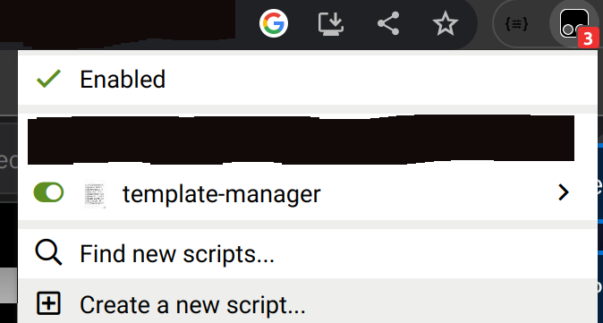
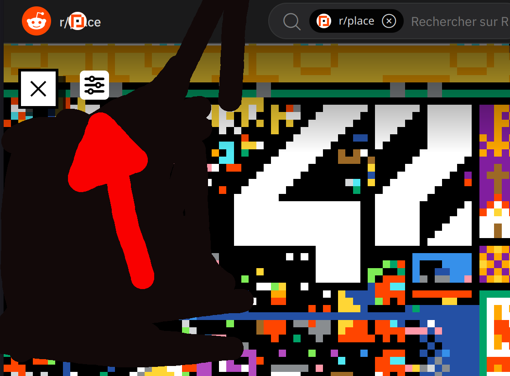
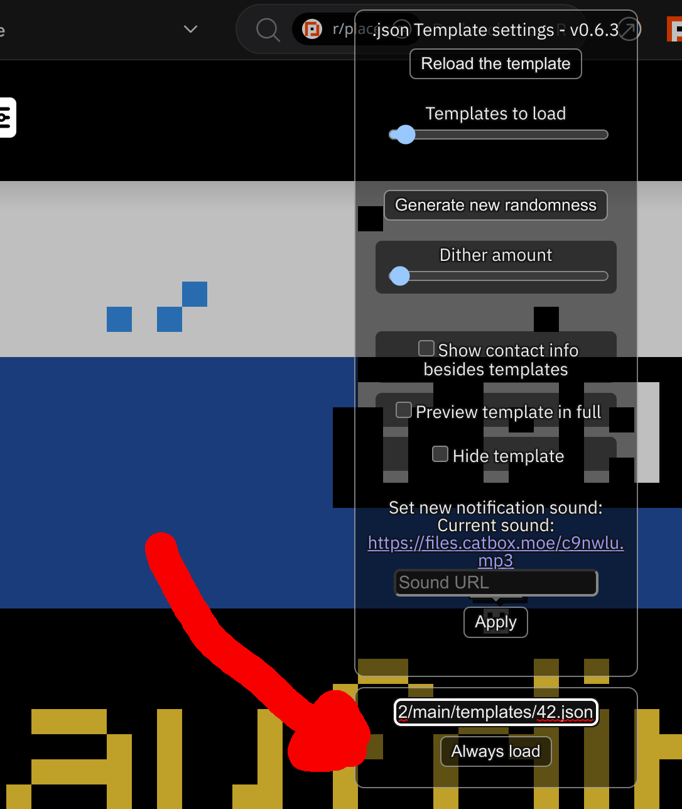

### Overlay Instruction

#### Steps
* Install [tampermonkey](https://www.tampermonkey.net/) in your browser
  - Chrome: [Tampermonkey - Chrome Web Store](https://chrome.google.com/webstore/detail/tampermonkey/dhdgffkkebhmkfjojejmpbldmpobfkfo).
  - Firefox: [Tampermonkey - Firefox Addons](https://addons.mozilla.org/en-US/firefox/addon/tampermonkey/).
* Install the [overlay script by clicking on this link](https://raw.githubusercontent.com/osuplace/templateManager/main/dist/templateManager.user.js)
* Refresh the [rplace webpage](https://reddit.app.link/place?cx=-898&cy=-459&px=21&screenmode=fullscreen)
* Ensure the overlay extension is enabled
  

* Copy the link of template to overlay.
  For example this one: https://raw.githubusercontent.com/ggjulio/rplace42/main/templates/42.json
* Click on settings

* Paste the template url in 

* Enjoy
